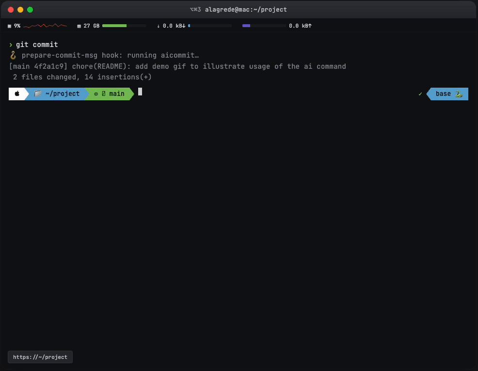

# aicommit-cli

> AI-powered git commit messages, in pure Bash, with zero runtime dependencies beyond `curl` and `python3`.

`aicommit` is a single-file Bash script that hooks into git's `prepare-commit-msg` to generate a commit message from your staged changes — using Claude, OpenAI, or a local Ollama model. Formatting rules live in a config file you control, so the output matches your team's conventions.

When you run `git commit`, your editor opens with a draft message already written. Edit it, save, done.



## Features

- **Pure Bash** — no Node, no virtualenv, no package manager. Just drop the script in your `$PATH`.
- **Multi-provider** — Claude (Anthropic), OpenAI, or Ollama (local). Switch with one config line.
- **Configurable formatting rules** — your `~/.aicommitrc` defines the style, language, and any extra instructions passed to the model.
- **Global config** — a single `~/.aicommitrc` (or `$XDG_CONFIG_HOME/aicommit/config`) applies to every repo.
- **Non-intrusive hook** — only generates a message when you didn't pass `-m`, didn't `--amend` a non-empty message, and aren't in a merge/squash. Otherwise it stays out of your way.
- **Inspect helper** — `aicommit inspect` shows local commits not yet pushed to upstream.

## Requirements

- `bash` 4+
- `git`
- `curl`
- `python3` (used for safe JSON encoding/decoding)
- An API key for your chosen provider, or a running Ollama instance

## Installation

### 1. Install the script in your `$PATH`

```bash
curl -o /usr/local/bin/aicommit https://raw.githubusercontent.com/alagrede/aicommit-cli/main/aicommit
chmod +x /usr/local/bin/aicommit
```

Or, if you cloned the repo:

```bash
sudo install -m 755 aicommit /usr/local/bin/aicommit
```

### 2. Set your API key

Add to your `~/.bashrc` or `~/.zshrc`:

```bash
# For Claude (default)
export ANTHROPIC_API_KEY="sk-ant-..."

# For OpenAI
export OPENAI_API_KEY="sk-..."

# For Ollama (optional, defaults to http://localhost:11434)
export OLLAMA_HOST="http://localhost:11434"
```

### 3. Install the hook in a repo

```bash
cd path/to/your/repo
aicommit install
```

This creates:

- `.git/hooks/prepare-commit-msg` — the hook itself
- `~/.aicommitrc` — an example global config file (only created the first time, if it doesn't exist yet)

## Usage

Once installed, just commit normally:

```bash
git add .
git commit
# → editor opens with an AI-generated message
# → review, edit if needed, save
```

If you pass a message with `-m`, the hook does nothing — you stay in control:

```bash
git commit -m "fix: typo"   # no AI call
```

### Other commands

```bash
aicommit inspect    # list local commits not yet pushed to upstream
aicommit generate   # print a generated message to stdout (without committing)
aicommit config     # show which config file and provider are active
aicommit uninstall  # remove the hook from the current repo
aicommit help       # full help
```

## Configuration

The script looks for a config file in this order (first match wins):

1. `$XDG_CONFIG_HOME/aicommit/config` (typically `~/.config/aicommit/config`)
2. `~/.aicommitrc`

The file is sourced as Bash, so you can use any shell expression.

### Example `~/.aicommitrc`

```bash
# Provider: claude | openai | ollama
PROVIDER="claude"

# Model name (depends on provider)
MODEL="claude-opus-4-5"
# MODEL="gpt-4o-mini"          # for openai
# MODEL="llama3.1"             # for ollama

# Output language
LANGUAGE="english"

# Max tokens for the generated message
MAX_TOKENS="500"

# How many lines of the staged diff to send to the model
INCLUDE_DIFF_LINES="400"

# Formatting rules — passed verbatim into the prompt.
# Tweak this to match your team's conventions.
STYLE_RULES="Use Conventional Commits format (type(scope): subject). Subject in imperative mood, lowercase, no period, max 72 chars. Add a blank line then a brief body explaining the WHY of the change, wrapped at 72 chars."

# Optional extra instructions appended to the prompt
EXTRA_INSTRUCTIONS="If the change is trivial (typo, formatting), keep it to a single line."
```

### Environment variable overrides

For one-off overrides (CI, scripts, etc.) you can set:

| Variable             | Effect                          |
| -------------------- | ------------------------------- |
| `AICOMMIT_PROVIDER`  | Override `PROVIDER` from config |
| `AICOMMIT_MODEL`     | Override `MODEL` from config    |
| `ANTHROPIC_API_KEY`  | Required for Claude provider    |
| `OPENAI_API_KEY`     | Required for OpenAI provider    |
| `OLLAMA_HOST`        | Ollama URL (default localhost)  |

## How it works

1. The `prepare-commit-msg` hook fires when you run `git commit`.
2. The hook bails out early if a message is already provided (`-m`, merge, squash, amend with existing message).
3. Otherwise, it grabs `git diff --cached` and the list of staged files.
4. It builds a prompt combining your `STYLE_RULES`, the diff, and the file list.
5. It calls the configured provider's HTTP API and writes the response into `COMMIT_EDITMSG`.
6. Git opens your editor with the generated message — you can accept, edit, or abort as usual.

## Tips

### Per-user config

Your `~/.aicommitrc` applies to every repo on your machine. The hook itself is per-clone (lives in `.git/hooks/`), so each contributor still runs `aicommit install` once per repo.

### Use a cheaper model for trivial changes

Set `MODEL="claude-haiku-4-5"` or `MODEL="gpt-4o-mini"` if you don't need the most capable model — commit messages usually don't.

### Combine with a pre-commit linter

`aicommit` runs at `prepare-commit-msg`, which fires after `pre-commit`. Your linters and tests run first; the AI message is generated only on a clean staged tree.

### Bigger commits

If you frequently commit large diffs, raise `INCLUDE_DIFF_LINES` (e.g. `1500`). Beware of token costs.

### Amending

`git commit --amend` with no flags will trigger the hook only if the current message is empty — otherwise your existing message is preserved.

## Troubleshooting

**The hook didn't fire.**
Check that `.git/hooks/prepare-commit-msg` exists and is executable. Run `aicommit install` again.

**`ANTHROPIC_API_KEY is not set`.**
Export it in your shell rc file and reload your terminal. Verify with `echo $ANTHROPIC_API_KEY`.

**Generation fails silently.**
The hook is designed to fail gracefully — if the API call breaks, it falls back to the empty editor so you can still commit. Run `aicommit generate` directly to see the raw error.

**Diff too large / costs blowing up.**
Lower `INCLUDE_DIFF_LINES`. The diff is truncated, not summarized — large commits will lose context past the cutoff.

**My message got overwritten.**
The hook only writes when the message is empty (ignoring git's auto-generated `#` comment lines). If you typed a message and it disappeared, please open an issue with reproduction steps.

## Uninstalling

Per repo:

```bash
aicommit uninstall
```

Globally:

```bash
sudo rm /usr/local/bin/aicommit
```

## Privacy & cost

`aicommit` sends your **staged diff** and **list of staged files** to the provider you configure. Do not use it on repositories containing secrets you wouldn't paste into a chat with that provider. For fully local operation, use `PROVIDER="ollama"`.

API costs are per-call and proportional to diff size. With Claude Haiku or GPT-4o-mini, expect well under a cent per commit on typical changes.

## Contributing

Issues and PRs welcome. The whole tool is one Bash script — keep it that way. No new runtime dependencies beyond what's already used.

## License

MIT
